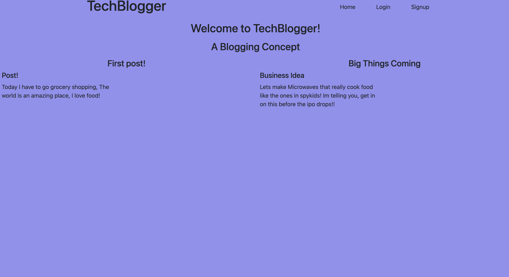

# Tech-Blogger

## 

## Table of Contents

- [Description](#Description)
- [Usage Information](#Usage-Information)
- [Contributions](#Contributions)
- [GitHub Page](#GitHub-Page)

## Description

The tech blogger app is designed for user registered users to post and comment on a public page.

deployed link : https://floating-earth-95689.herokuapp.com/

## Usage Information

When the user is first on the page he is introduced to a title, the name of hte forum, the post, the post subheader and the post content as well.

## Sample Page

## Contributions

- Oliver Shih

## GitHub Page

https://github.com/Elvis2681/Tech-Blogger
